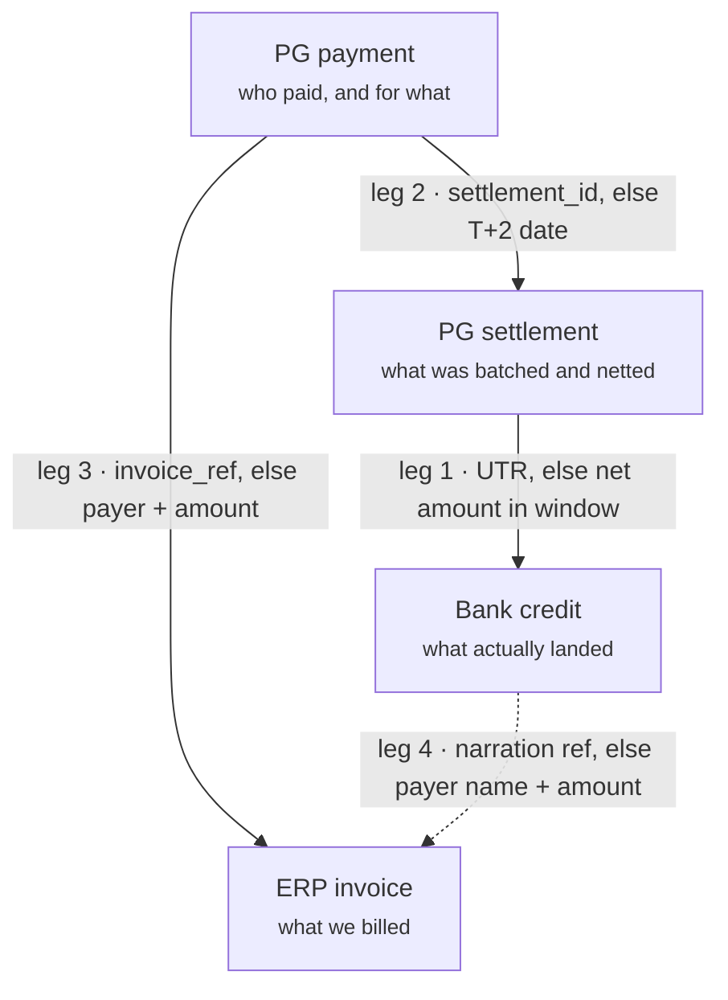
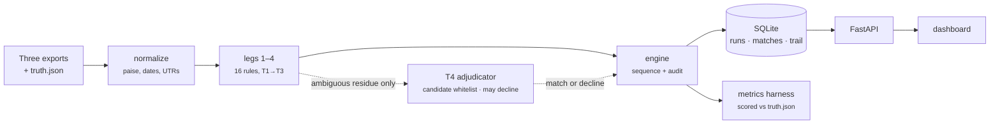

# LedgerStein — functionality and architecture

Reference for the reconciliation engine: what it joins, how a match gets made,
what lands in the exception queue, and how any of it is scored.

Every figure below comes from `batch_b`, the held-out batch the engine was never
tuned against. Reproduce with:

```bash
cd backend && python -m app.cli reconcile ../data/generated/batch_b
```

| | |
|---|---|
| Source rows | 620 |
| Matched | 476 |
| Precision | 100.0% |
| Recall | 98.6% |
| Cost of false matches | ₹0 |
| Exception queue | 93 rows, ₹1.17 Cr exposure |
| Tests | 37 |

---

## 1. The problem

A merchant's money leaves three separate trails and none of them agree.

| Source | System of record for | What it cannot know |
|---|---|---|
| **ERP invoice ledger**<br>`erp_invoices.csv`, `erp_customers.csv` | What the merchant expected to collect, from whom, by when | Whether it ever landed, and net of what fees |
| **Razorpay exports**<br>`pg_payments.csv`, `pg_settlements.csv` | What the gateway collected, charged, and paid out per batch | Invoice context, and any receipt that bypassed the gateway |
| **Bank statement**<br>`bank_statement.csv` | What actually credited the current account, and when | Which invoices or payments a credit belongs to |

The gaps are not clerical noise. A payout settles on T+2 and the credit lands a
day later still. A credit is short by the gateway fee plus 18% GST on that fee.
Three payouts arrive as one lump sum carrying only the first one's UTR. A
customer NEFTs straight to the bank and the ERP never hears about it. A refund
claws back from a later payout, so `net` stops equalling `gross − fee − tax`.

## 2. The four legs

Closing the loop on one rupee takes four joins. The payment row is the hub — the
only place invoice context and settlement context meet.



Leg 4 is dashed because it is the exception path: the customer paid the bank
directly, so there is no gateway row in between to hang the join off.

**Order matters.** Leg 4 only ever sees bank credits that leg 1 did not already
claim, so a settlement payout is never also read as a direct customer transfer.

## 3. The tier ladder

Within every leg, rules run cheapest and most certain first. A rule only ever
sees what the rules above it could not resolve. That ordering buys two things:
expensive inference runs on a handful of rows rather than the batch, and a cheap
certain match is never overridden by an expensive plausible one.

| Tier | Method | Cost | Resolves | Confidence |
|---|---|---|---|---|
| `T1_EXACT` | Exact key match — UTR in narration, `settlement_id` on the export, invoice number quoted verbatim | free | the clean ~82% | 1.00 |
| `T2_DERIVED` | `net = gross − fee − tax − adjustment` inside a dated window; reference canonicalisation | free | fee/GST netting, T+2 skew, rounding, typos | 0.86–0.95 |
| `T3_INFERRED` | Bounded subset-sum, fuzzy similarity, customer-and-amount inference, split-payment pairing | cheap | merged payouts, split payments, reference-less payments | 0.70–0.82 |
| `T4_ADJUDICATED` | LLM handed a candidate whitelist, allowed to decline (§7) | metered | genuinely ambiguous residue only | ≥0.60 |

### Tuning constants

| Constant | Value | Meaning |
|---|---|---|
| `ROUNDING_TOLERANCE_PAISE` | 100 | One rupee. Beyond this it is not rounding, it is a difference. |
| `CREDIT_WINDOW_DAYS` | 4 | How long after a payout a credit may legitimately land. |
| `FUZZY_REF_THRESHOLD` | 0.82 | Below this, a reference match is coincidence rather than a typo. |
| `SETTLEMENT_LAG_DAYS` | 2 | Razorpay's T+2 cycle, in business days. |

> **Subset-sum is bounded to three members and returned only when the
> combination is unique.** Over an unbounded pool it will find *a* combination
> for almost any number. An ambiguous one is not a near-miss — it is a confident
> wrong answer with a plausible explanation attached.

## 4. Rule reference

Seventeen rules can produce a match: sixteen deterministic, plus the
adjudicator. Each stamps its id onto the match and into the audit trail, so any
row on screen traces to the exact logic that decided it.

| Rule id | Leg | Tier | Fires when |
|---|---|---|---|
| `utr_exact` | 1 | T1 | The settlement's UTR appears in exactly one credit's narration or ref column |
| `utr_exact_first_of_duplicates` | 1 | T1 | Same UTR on several lines. Matches the earliest, flags the rest as duplicates |
| `net_amount_in_window` | 1 | T2 | No UTR, but exactly one credit for the exact net amount landed inside the window |
| `net_amount_within_rounding` | 1 | T2 | As above, differing by up to a rupee |
| `merged_payout_residual` | 1 | T3 | A credit claimed by one UTR exceeds that payout; the leftover resolves to a unique set of others |
| `merged_payout_subset_sum` | 1 | T3 | An unclaimed credit equals the sum of two or three payouts, uniquely |
| `settlement_id_present` | 2 | T1 | The gateway export carries the settlement id directly |
| `t_plus_two_settlement_date` | 2 | T2 | Export omitted it, but T+2 from capture lands on a day with exactly one payout |
| `invoice_ref_exact` | 3 | T1 | Payment quotes an invoice verbatim **and** the payer owns it |
| `invoice_ref_canonical` | 3 | T2 | The reference normalises to a real invoice — dashes, case, O-for-zero collapsed |
| `invoice_ref_fuzzy` | 3 | T3 | Similarity ≥ 0.82 against a unique invoice, amounts agree |
| `invoice_ref_fuzzy_weak` | 3 | T3 | Same, but the amounts disagree — lower confidence |
| `customer_amount_date` | 3 | T3 | No reference, but the payer has exactly one open invoice for that amount in 60 days |
| `split_payment_pair` | 3 | T3 | Two payments from one customer sum to one open invoice |
| `narration_invoice_ref` | 4 | T1/T2 | A non-gateway credit's narration quotes a real invoice number |
| `payer_name_and_amount` | 4 | T3 | No readable reference, but payer name plus exact amount identify one invoice |
| `llm_adjudicated` | 3 | T4 | The adjudicator chose from a whitelist, above the confidence floor |

### The corroboration rule

Leg 3's exact and canonical rules do not trust a reference on its own. Before
accepting it, the engine checks the payer actually owns the invoice they quoted,
going through the ERP customer master to get from the email on a payment to the
customer id on an invoice.

That check is not decoration. A transposed digit does not always land on
nothing — sometimes it lands on another customer's live invoice, and then a
reference-only rule produces a confident, fully explainable, wrong match.
Seeding that case cost **9 false matches worth ₹7.96 lakh** before corroboration
went in.

## 5. Where rows land

| Tier | Matched | Share | Precision |
|---|---:|---:|---:|
| `T1_EXACT` | 391 | 82.1% | 100% |
| `T2_DERIVED` | 47 | 9.9% | 100% |
| `T3_INFERRED` | 38 | 8.0% | 100% |
| `T4_ADJUDICATED` | 0 | — | — |

The inferred rules are not buying recall by guessing. The 93 rows that did not
become matches went to the queue carrying ₹1.17 crore between them.

> **An early version scored 100% precision *and* 100% recall on both batches.**
> That measured the benchmark, not the matcher — every seeded defect was
> solvable given enough arithmetic. Three injectors in `app/gen/ambiguity.py`
> fixed it. Recall below 100% is now the *correct* answer.

## 6. Exception taxonomy

Ten types. Grouped by what they demand of a human, because that is what changes.

| Type | Kind | Means | Raised on |
|---|---|---|---|
| `MISSING_CREDIT` | money | Payout reported, no matching credit ever reached the account | settlement |
| `DUPLICATE_CREDIT` | money | Bank feed posted the same credit twice — same UTR, amount, date | bank txn |
| `VALUE_VARIANCE` | money | Link is certain (UTR proves it) but the credit is short. A deduction to chase, not a mismatch to re-match | bank txn |
| `FEE_MISMATCH` | money | Payments assigned to a payout do not sum to its reported gross | settlement |
| `OVERDUE_INVOICE` | money | Raised, past due, nothing paid it. A receivable, not a break | invoice |
| `AMBIGUOUS` | judgement | Two or more candidates fit equally well. Carries every candidate considered | payment |
| `CROSSED_REFERENCE` | judgement | Payment quotes a live invoice raised on a different customer | payment |
| `UNBILLED_RECEIPT` | judgement | Money arrived with no reference and no open invoice that fits | payment, bank txn |
| `DIRECT_TRANSFER` | judgement | A credit that bypassed the gateway and could not be attributed | bank txn |
| `PENDING_SETTLEMENT` | informational | Captured inside the T+2 window, settles after the statement ends. Not a break | payment |

### What never reaches the queue

Ordinary business traffic is classified out of the way: interest credits, bank
charges, payroll, GST challans, vendor payouts, autopay mandates. A narration
classifier in `app/recon/normalize.py` labels them, and the label goes into the
audit trail so the decision to ignore a row is itself on the record.

That table is data, not logic — a merchant edits `OPERATING_PATTERNS`. Letting
operating traffic accumulate as exceptions is the fastest way to build a queue
nobody reads.

## 7. The LLM contract

Tier 4 exists for one shape of problem: a payment that fits two open invoices
equally well on amount, customer and date. No arithmetic separates them. What
might is judgement — which invoice a customer is more likely to have been
paying, given ageing, the PO reference, and what the ERP already believes.

Four constraints make acting on that answer defensible:

1. **A candidate whitelist.** The model may only choose from a set it is handed.
   The check runs in code *after* the call, not as an instruction in the prompt —
   so a hallucinated identifier becomes a rejected response, never a match.
2. **Declining is permitted**, and expected when the evidence is symmetric. A
   tier that must produce an answer will produce a wrong one.
3. **A confidence floor** of 0.60 drops hedged answers back into the queue.
4. **A call budget** caps spend, and a run without credentials skips the tier and
   logs why rather than guessing.

The tier only ever sees `AMBIGUOUS` exceptions on leg 3 that already carry two or
more candidates.

The whitelist guarantee is covered by
`test_an_invented_invoice_number_is_rejected_not_matched` in
`backend/tests/test_adjudicator.py`: a stub client returns a confident,
fabricated invoice number, and the assertion is that no match is produced, the
row stays in the queue, and a `reject` event lands in the trail. Eight further
tests cover the confidence floor, explicit declines, API failures, the call
budget, credential absence, and that both candidates reach the prompt verbatim.

Model and parameters live in `app/recon/adjudicator.py`: `claude-opus-5` by
default, called through `client.messages.parse()` with a Pydantic `Verdict`
schema so the response shape is guaranteed before the whitelist check runs.

## 8. How it is scored

The generator writes `truth.json` alongside the CSVs, recording every true
linkage and every row that correctly matches nothing. The engine never reads it;
the metrics harness does.

**Precision is reported before recall.** A missing match sits in a queue. A wrong
match closes a book. A scorecard that averages them hides the expensive one.

**False matches are priced in rupees.** Five wrong matches on five-rupee rows and
five on five-lakh rows are not the same event.

**The exception queue is graded, not counted.** Declining a row that genuinely
has no partner is correct and scores as such. Declining one that *did* have a
partner is a miss. The grade is per leg — a payment that settled but was never
invoiced has a leg 2 link and no leg 3 link, so flagging it as unbilled on leg 3
is right, and counting that as a miss would score the wrong question.

**Tuned on A, reported on B.** Two batches, different seeds and sizes. Every rule
was written against `batch_a`. Every number published comes from `batch_b`.

## 9. Architecture



The adjudicator sits off the spine, not inside it. It cannot see a row until the
deterministic rules have declined it, and its answer re-enters through the
engine — where the whitelist check runs — rather than being written straight to
a match.

### Module map

| Module | Responsibility |
|---|---|
| `gen/scenarios.py` | The defect taxonomy — what can go wrong, and how often |
| `gen/records.py` | Row shapes for the three sources, and the ground-truth container |
| `gen/generate.py` | Builds a seeded month: customers, invoices, payments, payouts, statement |
| `gen/ambiguity.py` | Injects cases not solvable from the data alone |
| `recon/model.py` | Match, Exception, AuditEvent, and the typed source rows |
| `recon/normalize.py` | CSV loading, UTR and reference extraction, narration classification |
| `recon/legs.py` | The four joins and every rule inside them |
| `recon/engine.py` | Sequences the legs, owns the audit trail, calls the adjudicator |
| `recon/adjudicator.py` | Tier 4, and the whitelist enforcement around it |
| `recon/metrics.py` | Scores a run against ground truth; renders the terminal scorecard |
| `db.py` | SQLAlchemy models and single-transaction persistence |
| `main.py` | FastAPI routes |
| `cli.py` | Terminal entry point |

### Two constraints worth knowing

**Money is integer paise everywhere.** No float touches an amount. An engine off
by a paisa because of binary rounding is worse than useless — the error stays
invisible until it is large.

**The reconciliation core is stdlib-only.** No pandas, no rapidfuzz; `difflib`
does the fuzzy matching. Throughput figures are the engine's own rather than
borrowed from a C extension, and the whole matcher stays readable in one sitting.

## 10. Data model

Four tables, written in a single transaction — a half-written trail is worse
than none, because it looks complete.

| Table | Row means | Notable columns |
|---|---|---|
| `runs` | One pass over one batch | `id` `batch` `duration_seconds` `rows` `match_count` `exception_count` `exception_value_paise` `llm_calls` `scorecard` |
| `matches` | One resolved link | `leg` `left_id` `right_id` `tier` `rule` `reason` `confidence` `amount_paise` |
| `exceptions` | One row refused a match | `entity_type` `entity_id` `exception_type` `reason` `candidates` `status` `resolution` `resolved_by` `resolved_at` |
| `audit` | One decision, in sequence. Append-only | `sequence` `at` `actor` `action` `leg` `subject` `detail` `confidence` |

`scorecard` is empty when the batch shipped no `truth.json` — the real-world
case, since a live merchant has no answer key.

### Actors in the trail

Every row names who decided: `rule:<name>`, `llm:<model>`, `human:<user>`, or
`engine`. Actions are `start`, `match`, `flag`, `classify`, `decline`, `reject`,
`error`, `skip`, `resolve`, `finish`.

```
0002  rule:utr_exact               match    setl_5ue00m3wumbpbq -> TXN000002
      UTR HDFCN26155995456 appears in the narration of TXN000002.

0026  rule:merged_payout_residual  match    setl_94yd8o2jyr29vk -> TXN000036
      Credit TXN000036 exceeds the payout its UTR names by Rs 21,61,365.25,
      which is exactly this payout and 1 other.

0029  engine                       flag     TXN000040
      VALUE_VARIANCE: Credit is Rs 2,500.00 short of the 1 payout(s) matched
      to it. The link is certain -- the UTR proves it -- so this is a
      deduction to chase, not a mismatch to re-match.

0621  human:abdul                  resolve  pay_p8aqc68xw55ck7
      AMBIGUOUS resolved as: Confirmed with the customer's AP team.
      (linked to INV-2026-0073)
```

A human override lands in the same sequence as the engine's own decisions,
because a person overruling the machine is a decision that has to be exactly as
reviewable. Re-resolving a closed exception returns `409` rather than silently
rewriting history.

## 11. API reference

Interactive docs at `/docs` once the service is running.

| Method | Path | Does |
|---|---|---|
| `GET` | `/api/health` | Liveness, data root, batch count |
| `GET` | `/api/batches` | Batches on disk, and whether each carries an answer key |
| `POST` | `/api/runs` | Reconcile a batch. Body: `batch`, `use_llm`, `model`, `max_llm_calls` |
| `GET` | `/api/runs` | Recent runs, newest first |
| `GET` | `/api/runs/{id}` | Summary plus full scorecard, or `null` where there was no ground truth |
| `GET` | `/api/runs/{id}/matches` | Matches, filterable by `leg` and `tier` |
| `GET` | `/api/runs/{id}/exceptions` | The queue, ordered by exposure. Filterable by `exception_type`, `status` |
| `GET` | `/api/runs/{id}/exception-summary` | Counts and exposure per type, worst first |
| `POST` | `/api/exceptions/{id}/resolve` | Close one by hand. Writes to the trail; `409` if already closed |
| `GET` | `/api/runs/{id}/audit` | The trail, filterable by `subject`, `actor`, `action` |

## 12. The dashboard

React 19, Vite 8, Tailwind 4, proxying `/api` to the service. Four screens, one
idea each.

| Screen | The one idea |
|---|---|
| **Scorecard** | Precision sits left of recall; the rupee cost of false matches gets its own tile |
| **Exceptions** | Ordered by exposure, not insertion. Selecting a row shows the candidates the engine refused to choose between, and a form that records the decision |
| **Matches** | Every link with the rule that made it and a readable reason |
| **Audit trail** | Every decision in order, machine and human alike, searchable |

Nothing on screen is computed in the browser. Every figure came from the engine,
so the front end cannot flatter a result by accident.

## 13. Running it

```bash
# Generate the batches
cd backend
python -m app.gen.generate --seed 7    --invoices 240                --out ../data/generated/batch_a
python -m app.gen.generate --seed 4291 --invoices 260 --customers 21 --out ../data/generated/batch_b
# --ambiguity 0 generates a solvable batch, for comparison

# Score it
python -m app.cli reconcile ../data/generated/batch_b
python -m app.cli reconcile ../data/generated/batch_b --audit trail.txt --json card.json

# With the adjudicator on the ambiguous residue
export ANTHROPIC_API_KEY=...
python -m app.cli reconcile ../data/generated/batch_b --llm --max-llm-calls 25

# Service and dashboard
python -m uvicorn app.main:app --reload      # http://127.0.0.1:8000/docs
cd ../frontend && npm install && npm run dev # http://localhost:5173

# Tests
cd backend && python -m pytest               # 37 passing
```

Fifteen tests cover generator invariants — settlement arithmetic closing to the
paisa, the statement balance running as a true total, nothing unmatchable by
construction. Nine cover the adjudicator's safety properties. Eleven exercise the
API end to end against the real engine.

### Configuration

| Variable | Default | Purpose |
|---|---|---|
| `LEDGERSTEIN_DB_URL` | `sqlite:///./ledgerstein.sqlite3` | Where runs are persisted |
| `ANTHROPIC_API_KEY` | — | Absent means tier 4 skips and logs why |
| `LEDGERSTEIN_MODEL` | `claude-opus-5` | Adjudicator model |
